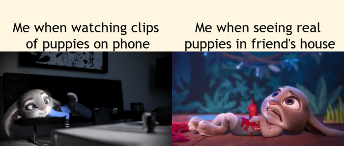

# Steps to create the meme 
Below are some steps that I used to create the meme shown.


* I use the R package [Magick](https://cran.r-project.org/web/packages/magick/vignettes/intro.html) to create the meme.

## Step 1

I create two empty rectangles and add one statement in each rectangle. Below are the R code I wrote.

```{r}
#text one
text1 <- image_blank(width = 500, 
                     height = 150, 
                     color = "#fef6e1") %>%
  image_annotate(text = "Me when watching clips\n of puppies on phone", 
                 font = "Trebuchet", 
                 size = "40",
                 gravity = "South")

#text two
text2 <- image_blank(width = 500, 
                    height = 150, 
                    color = "#fef6e1") %>%
  image_annotate(text = "Me when seeing real\n puppies in friend's house",
                 size = "40",
                 font = "Trebuchet",
                 gravity = "South")
```

## Step 2

I find the two images below from the web. I then crop the images to the desired height and width and scale them. *The details of the images are in the **reference** section below.*


Below is the R code I wrote.

```{r}
#image one
happy_rabbit <- image_read("https://i.pinimg.com/originals/ca/2c/45/ca2c450faa4d350db3b79e0b571d0c20.png") %>%
  image_crop("1000x550") %>%
  image_scale(500)

#image two
scared_rabbit <- image_read("https://i.ytimg.com/vi/PEyMsHQlExY/maxresdefault.jpg") %>%
  image_crop("1000x620+75") %>%
  image_flip() %>%
  image_crop("1000x520+55") %>%
  image_flip() %>%
  image_scale(500)
```

## Step 3

I combine the two rectangles as a row and the two images as a row. I then stack them up and it becomes the meme. Below is the R code I wrote.

```{r]
#text row
first_row <- image_append(c(text1, text2))

#image row
second_row <- image_append(c(happy_rabbit, scared_rabbit))

#meme
meme <- c(first_row, second_row) %>%
  image_append(stack = TRUE) %>%
  image_scale(700)
```

### Reference
1. The first image is an image from [Pinterest](https://www.pinterest.com.au/pin/299419075213364556/)
2. The second image is a screenshot from a [youtube video](https://www.youtube.com/watch?v=PEyMsHQlExY&t=13s)
